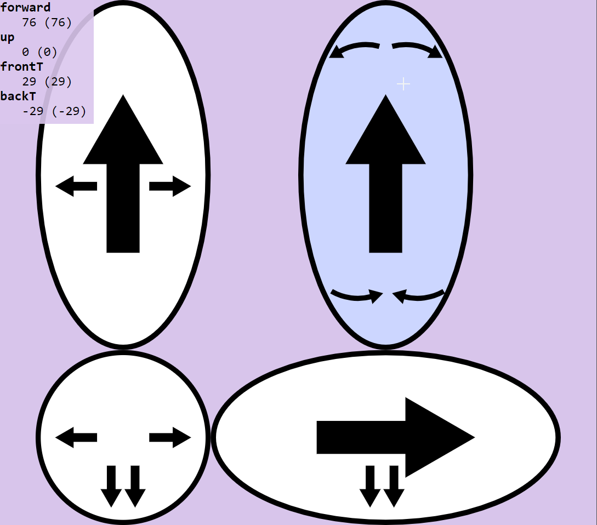

# Node Remote

An airship remote controller for movement in 3d.



## Packing the JS

(so as to see the remote in action)

```bash
npm install
npm run build
```

You can then open `index.html` to see the remote in action.

The remote also works on phones.

## Interface

The remote currently POSTs a JSON containing the value for each affected
key to the root of the server. See `src/remoteV2.js:handleMouseMove`, `src/Motors.js:setSpeed`, `src/Motors.js:__send` and
`src/util/futil.js:justPostJSON`.

The JSON may be empty if the remote is just indicating checking out the
connection, for the server to know it was not lost. The periodicity for
those checkings is `const AUTO_RESEND_TIMING = 700ms`.

When the user releases the click, an JSON with all keys set to 0 is sent
to the the server.

## Develop

To run a developement server, use:

```bash
npm run dev
```

### File Structure

See `RESPONSIBILITY_BREAKDOWN.md` for the details of what do what.

## Authors and Contributors

* Mathieu CAROFF <mathieu.caroff@free.fr>